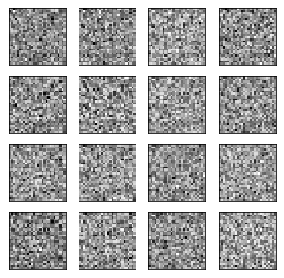
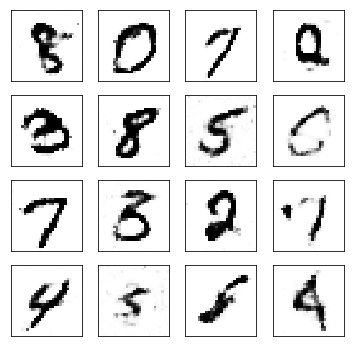
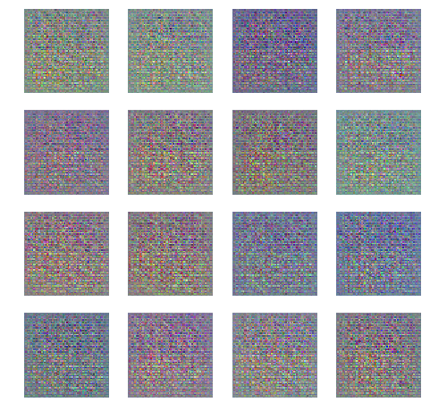
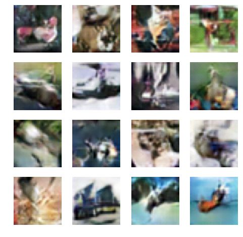

#  gans: Generative Adversarial Networks
Multiple Generative Adversarial Networks (GANs) implemented in PyTorch and Tensorflow
 

## Vanilla GANs
Vanilla GANs found in this project were developed based on the original paper [Generative Adversarial Networks](https://arxiv.org/abs/1406.2661) by Goodfellow et al.

These are trained on the [MNIST dataset](http://yann.lecun.com/exdb/mnist/), and learn to create hand-written digit images using a 1-Dimensional vector representation for 2D input images.
- [PyTorch Notebook](https://github.com/diegoalejogm/gans/blob/master/Vanilla%20GAN%20PyTorch.ipynb)
- [TensorFlow Notebook](https://github.com/diegoalejogm/gans/blob/master/Vanilla%20GAN%20TensorFlow.ipynb)

 

__MNIST-like generated images before & after training.__

## DCGANs
Deep Convolutional Generative Adversarial Networks (DCGANs) in this repository were developed based on the original paper [Unsupervised Representation Learning with Deep Convolutional Generative Adversarial Networks](https://arxiv.org/abs/1511.06434) by Radford et al.

These are trained on the [CIFAR10](https://www.cs.toronto.edu/~kriz/cifar.html) and the [MNIST](http://yann.lecun.com/exdb/mnist/) datasets. They use 3 dimensional representations for images (length x height x colors) directly for training.

- [TensorFlow CIFAR10 Notebook](https://github.com/diegoalejogm/gans/blob/master/DC-GAN%20TensorFlow.ipynb)
- [PyTorch CIFAR10 Notebook](https://github.com/diegoalejogm/gans/blob/master/DC-GAN%20PyTorch.ipynb)
- [PyTorch MNIST Notebook](https://github.com/diegoalejogm/gans/blob/master/DC-GAN%20PyTorch%20(MNIST).ipynb)

 

__CIFAR-like generated images before & after training.__
